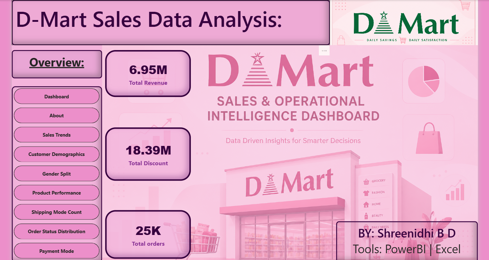
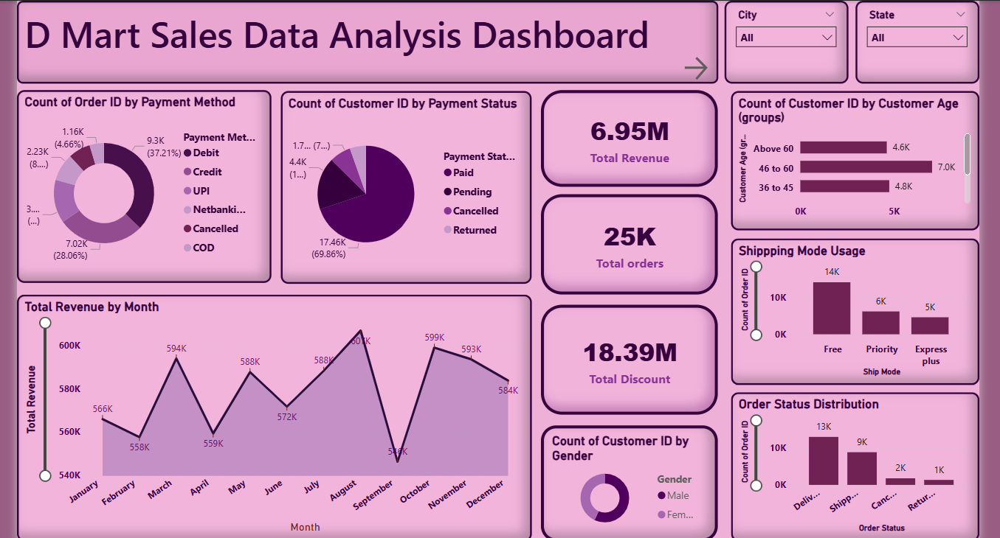

# DMart Sales & Operational Intelligence Dashboard

## 📌 Project Overview
This project focuses on analyzing DMart retail transaction data using Power BI to generate business insights related to sales performance, customer behavior, product analysis, and operational efficiency.

The dashboard was created as part of an internship project to demonstrate data visualization, business intelligence, and analytical skills.

## 🎯 Objectives
- Analyze sales and revenue trends
- Understand customer demographics and purchasing behavior
- Evaluate product performance and discount impact
- Analyze operational metrics such as shipping and order status
- Build an interactive Power BI dashboard for decision-making

## 🛠️ Tools & Technologies Used
- Power BI Desktop
- Power Query
- DAX (Data Analysis Expressions)
- CSV Dataset

## 📂 Dataset Information
The dataset contains:
- 25,000+ retail transaction records
- 29 columns including customer details, product information, sales metrics, and operational data

### Important Columns
- Customer Age
- Gender
- Product Name
- Category
- MRP
- Discount Price
- Payment Method
- Ship Mode
- Order Status
- Order Date
- Delivery Date

## 📊 Dashboard Features

### KPI Cards
- Total Revenue
- Total Orders
- Average Order Value
- Cancellation Rate

### Visualizations
- Monthly Sales Trend
- Customer Demographics
- Product Performance Analysis
- Shipping Mode Analysis
- Order Status Distribution
- Discount vs Revenue Analysis

## 🔍 Key Insights
- Certain product categories contribute significantly to revenue
- Younger customer groups generate higher sales
- Discounts influence purchasing behavior
- Standard shipping is the most preferred shipping mode
- COD orders show higher cancellation probability

## 💡 Business Recommendations
- Optimize inventory for high-performing categories
- Improve logistics efficiency
- Reduce dependency on cash-on-delivery
- Implement targeted discount campaigns

## 📸 Homepage Preview

## 📸 Dashboard Preview

## 📁 Project Structure
Dashboard/
Dataset/
Report/
Images/
README.md

### 👩‍💻 Author
**Shreenidhi B D**  
Aspiring Data Analyst
📍 Bangalore, India  
📧 shreenidhibd@gmail.com 
